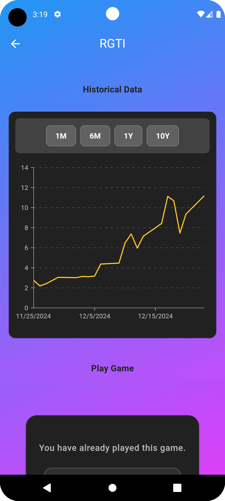
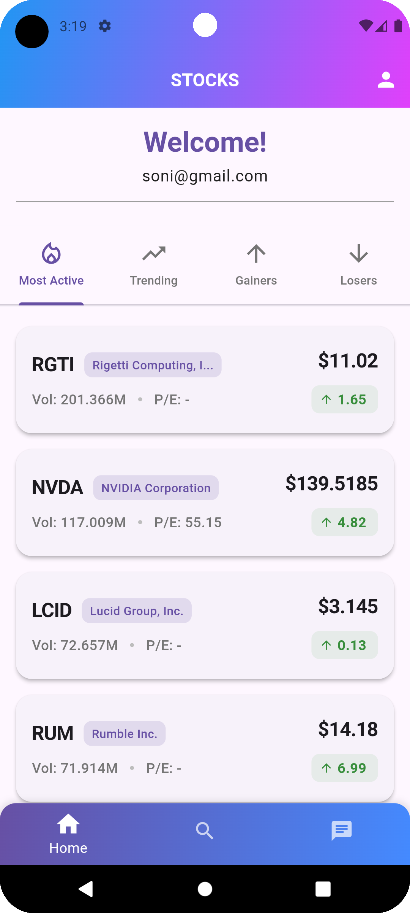
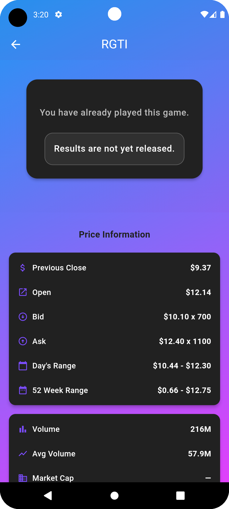

The app is a stock market tracking tool displaying real-time and cached stock data in four categories: Most Active, Trending, Gainers, and Losers. It uses tabs for navigation and fetches data from a stock service API, caching results for efficiency. The app checks if the market is open and refreshes data accordingly, ensuring up-to-date information during market hours. It handles errors gracefully and allows users to retry fetching data if needed. The UI is clean, responsive, and designed for a smooth user experience with visual indicators and tooltips.

 

 
 

 
 
 
